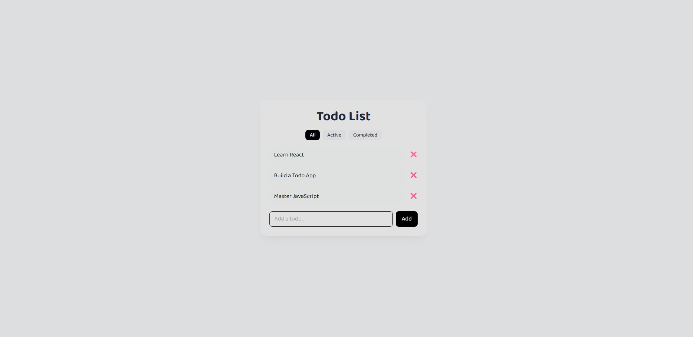

# React Todo App 🎉

React + Vite + Tailwind CSS ile yapılmıştır.  
localStorage desteği ve filtreleme özellikleri ile minimal bir proje.

---

## Canlı Demo
Projeyi canlı görmek için: [Tıkla!](https://react-todo-app-two-tau.vercel.app)

## Önizleme


## Özellikler

- Todo ekleme, silme ve tamamlandı olarak işaretleme ✅  
- Filtreleme: **All / Active / Completed**  
- LocalStorage ile tarayıcıda veri saklama  
- Modern, yuvarlak ve eğlenceli UI (Tailwind)  
- Responsive ve hover efektleri  

---

## Başlatma

```bash
# install repositories
npm install

# start project
npm run dev